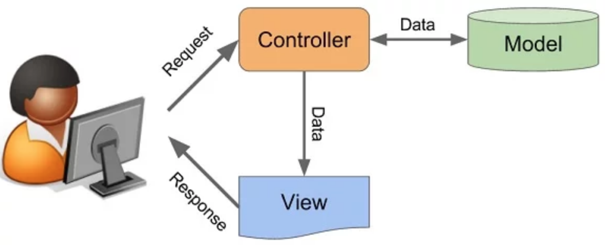

## Entendendo   MVC :
 É um padrão de arquitetura de software que divide a aplicação em três camadas:
 ### Model, View e Controller ###
 - M( Model) : é onde está o banco de dados da aplicaação

 - V (View) :responsável pela interação com o usuário. Nesta camada são apresentados os dados ao usuário.
 Os dados podem ser entregues em vários formatos, dependendo do que for preciso, como páginas HTML, arquivos XML,  vídeos, fotos, músicas etc.

  - C (Controller) : é responsável por lidar com as requisições do usuário. Ela gerencia as ações realizadas, fala qual Model e qual View utilizar para que a ação seja completada.
 Ela gerencia as ações realizadas, fala qual Model e qual View utilizar para que a ação seja completada.

Como o código é dividido em partes distintas, torna- se fácil adicionar novas funcionalidades e alterar características antigas. O código também fica mais fácil de ser compreendido por outros desenvolvedores.

 ## Como funciona  : ##

1 -  O usuário faz uma solicitação ( request) a um  site ( por xemplo). Geralmente será acionado acessando uma página do site site. Esse pedido chega ao controlador.

2 - O controller se comunica com o model,  informando  os dados que o usuario pediu a ele (model). As visualizações são solicitadas para o resultado correspondente, uma vez que as operações relevantes foram realizadas de acordo com a lógica do negócio.

3 - Para produzir saída, as exibições às vezes podem solicitar mais informações dos modelos. Às vezes, o controller será responsável por solicitar todos os dados dos modelos e enviá-los para o view, atuando como uma ponte entre eles. Seria comum uma coisa e outra, tudo depende da nossa implementação; 

4 - As exibições (response) será  enviadas  para o usuário em vários formatos como mp4, html, jng, pdf etc.

 ## Exemplo  MVC com Nodejs ##

